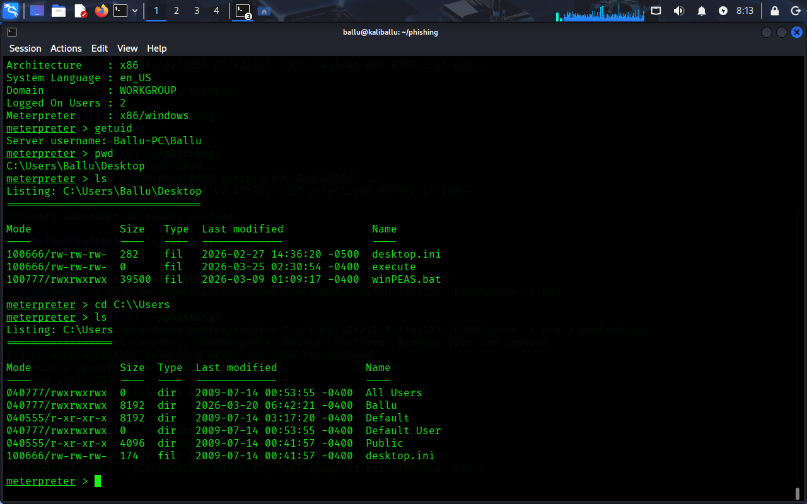
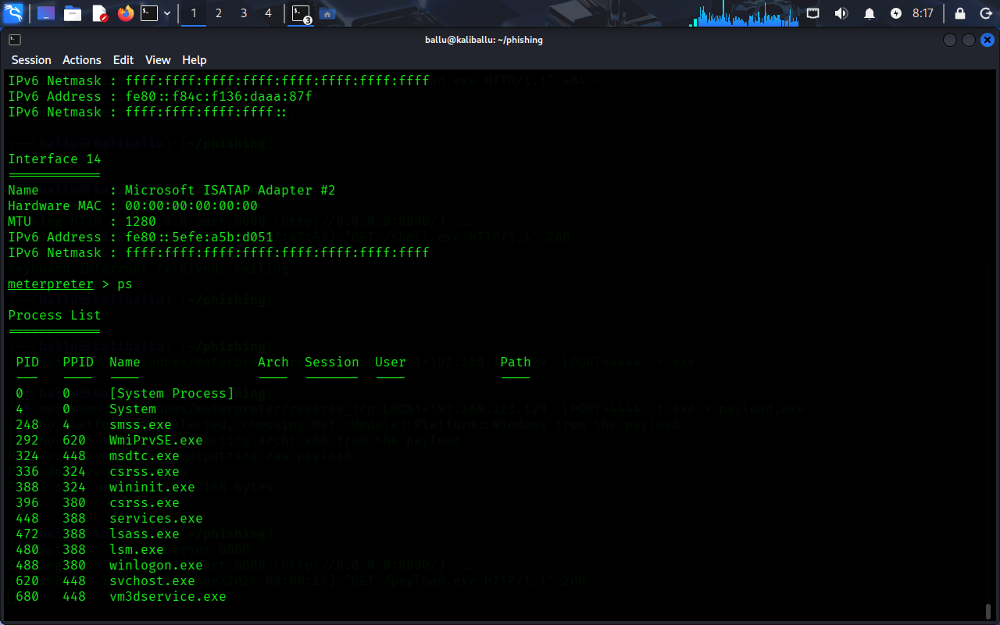

# network-pivoting-attack-simulation
Simulated internal network pivoting attack using Metasploit to access a non-directly reachable system via a compromised Windows machine.

# Internal Network Pivoting Attack Simulation

## 📌 Overview
This project demonstrates a network pivoting attack in a controlled lab environment. The objective was to access an internal system that was not directly reachable from the attacker machine by leveraging a compromised Windows system.

---

## 🎯 Objective
To simulate a real-world internal network penetration testing scenario using pivoting techniques and gain access to an isolated target machine.

---

## 🖥️ Lab Setup

- Attacker Machine: Kali Linux  
- Pivot Machine: Windows 10  
- Target Machine: Metasploitable  

### Network Configuration
- Kali ↔ Windows: 192.168.x.x  
- Windows ↔ Target: 10.x.x.x  
- No direct access between Kali and Target  

---

## ⚔️ Attack Methodology

### 1. Initial Access
A reverse connection payload was generated and executed on the Windows machine, resulting in a remote session.

*(Payload details have been generalized for security reasons)*

---

### 2. Establishing Pivot
The compromised Windows system was configured as a pivot point to access the internal network using Metasploit routing techniques.

---

### 3. Internal Network Discovery
Internal hosts and services were identified using scanning modules through the established pivot.

**Discovered Services:**
- FTP (21)  
- SSH (22)  
- Telnet (23)  
- HTTP (80)  
- SMB (139, 445)  

---

### 4. Exploitation
A known vulnerability in the SMB/Samba service was leveraged to gain access to the internal target system.

*(Exploit module details intentionally limited)*

---

### 5. Post-Exploitation
After successful exploitation:
- Command execution was achieved  
- User privileges were verified  
- Administrative/root-level access was obtained  

---

## 📊 Results

- Successfully bypassed network segmentation  
- Accessed internal system via pivoting  
- Gained full control over the target machine  

---

## 🛡️ Security Recommendations

- Apply regular security patches  
- Disable unnecessary services (e.g., SMB if not required)  
- Implement network segmentation and monitoring  
- Use endpoint detection and response (EDR) solutions  

---

## ⚠️ Disclaimer
This project was conducted in a controlled lab environment for educational and ethical purposes only. Do not attempt these techniques on unauthorized systems.

## 📸 Screenshots

### Meterpreter Session

### Process Enumeration

